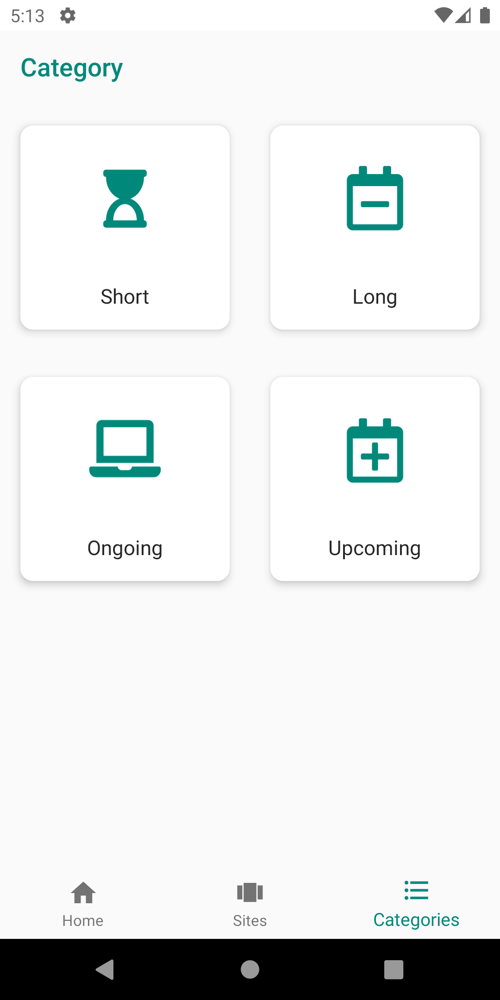
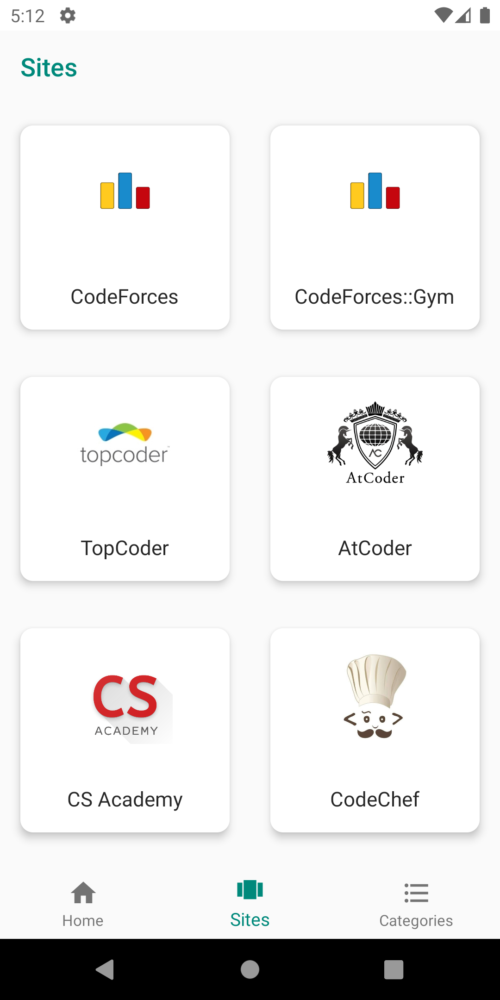
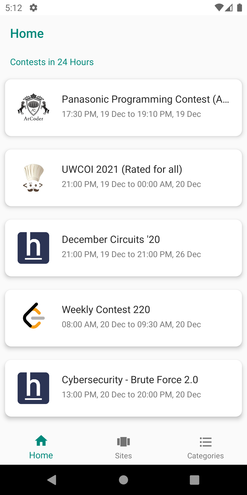
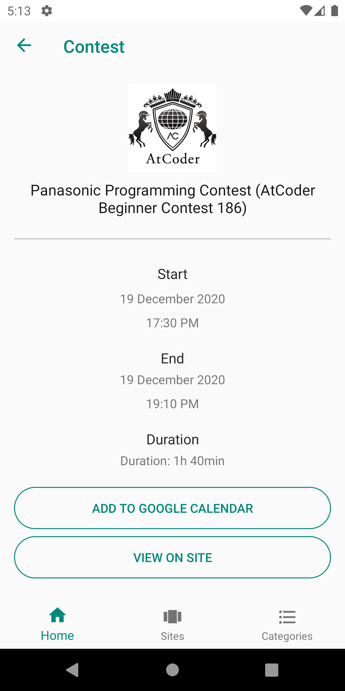

# Contests
Contests is an Android app which contains the information about upcoming programming contests on various popular sites which includes:

 1. CodeChef
 2. CodeForces
 3. AtCoder
 4. TopCoder
 5. LeetCode
 6. HackerRank
 7. HackerEarth
 8. Kick Start
 9. CS Academy
 
 Contests are also classified on the basis of their duration and status.
 This app also allows users to add the contest available in the app to the Google Calendar.
# Screenshots

     

---
### Todo

 1. Add settings activity to customize home screen 
 2. Improve UI of activities
 3. more to come ...

---
**API Used:** [https://kontests.net/api](https://kontests.net/api)

**Apk Link:** [Download Apk](https://github.com/Ankit2305/ImageResources/raw/master/Contests%20Apk/Contests.apk)
good project work buddy
